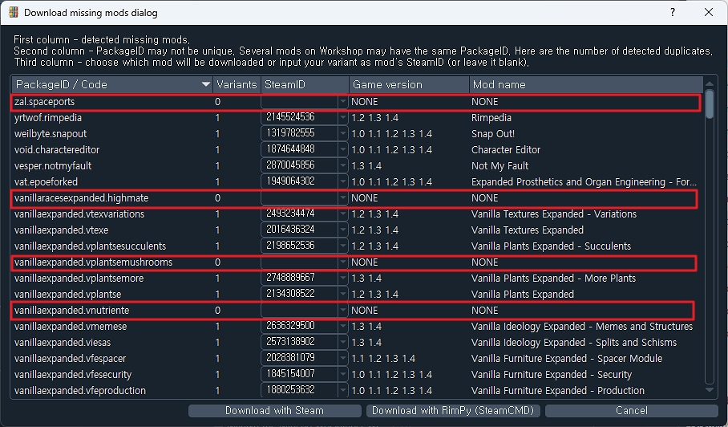
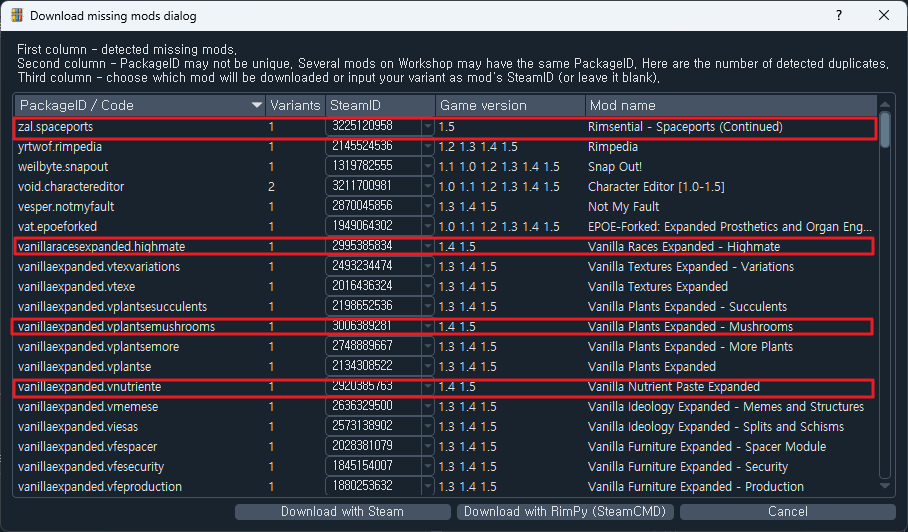

## Description:
Original File ( If you use it, cause Crash ) : steamDB.json   
**For Rimpy : db.json**

This is simply a modification of the DB structure to suit Rimpy.   
It prevents it from appearing as 'NONE' when you want to download a mode that doesn't exist when you load a list of modes.   
**Not all will be fixed, so if NONE still appears, you'll need to install it manually.**

## How to use:   
### Overwrite "db.json" To "path/to/Rimpy/database/db.json"

## Preview:   
**BEFORE**   
   
**AFTER**   

